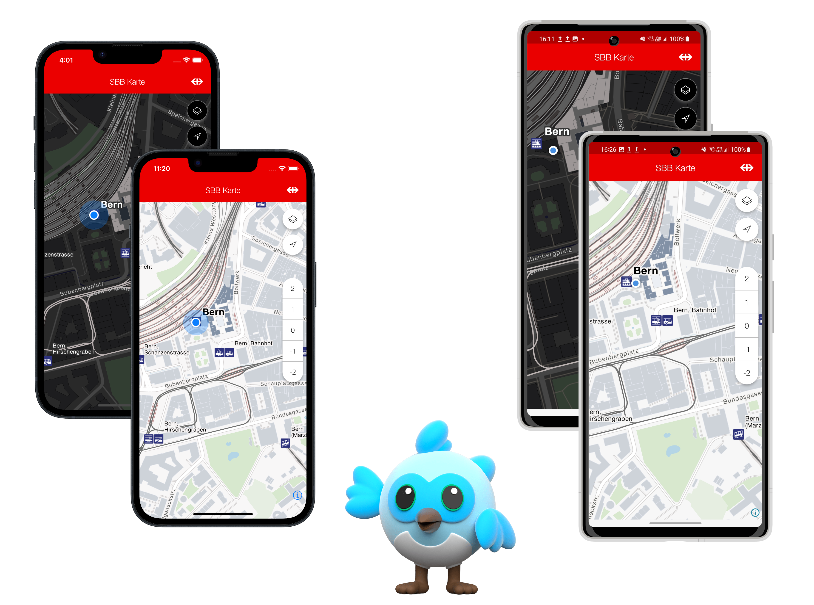
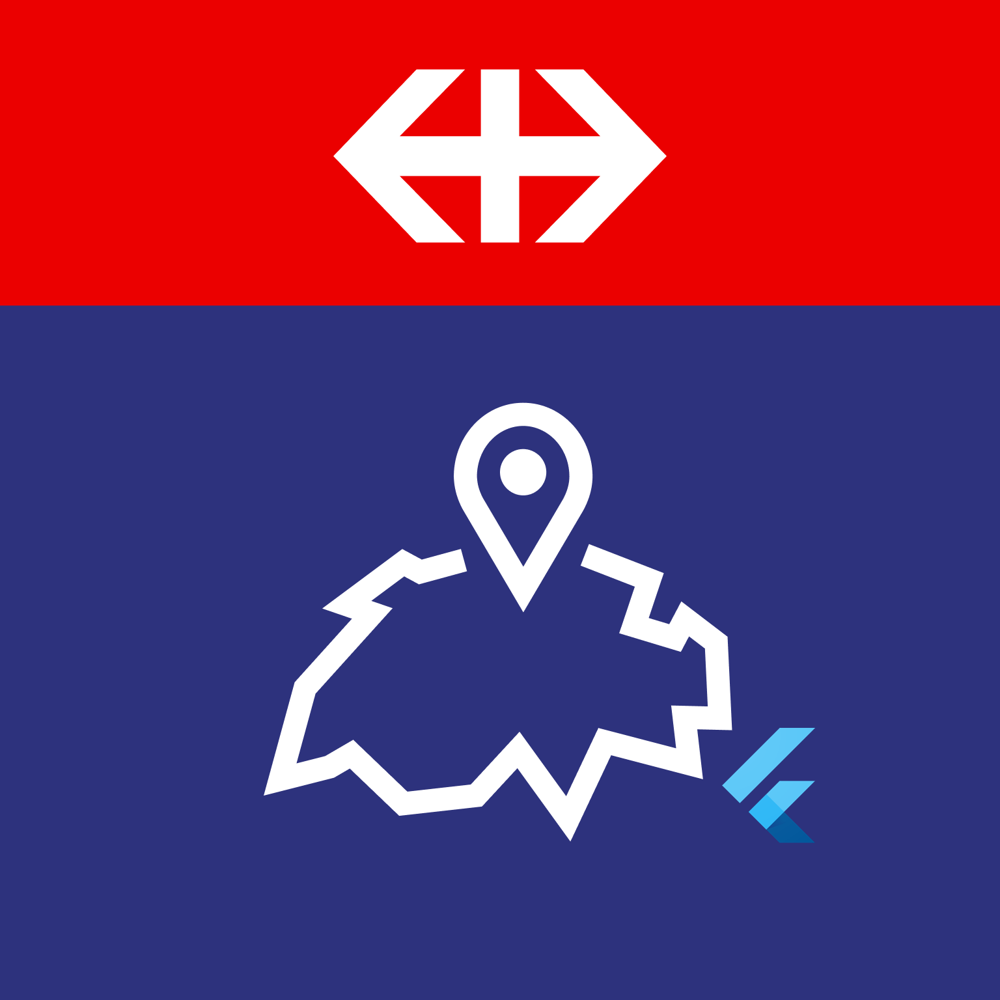
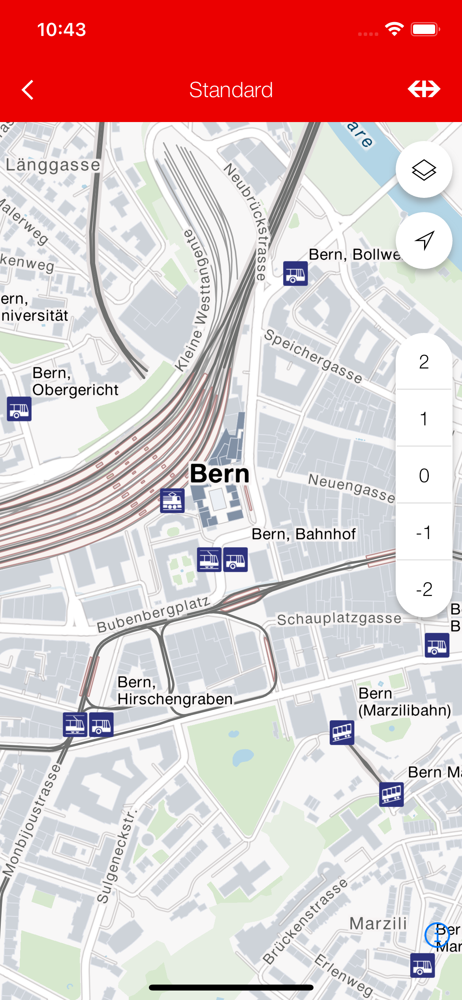
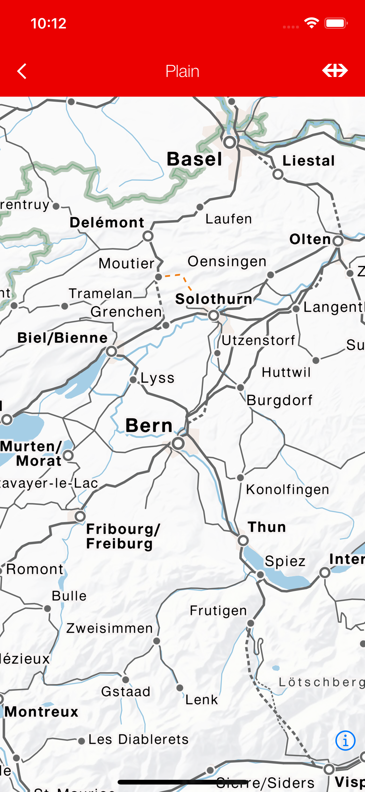
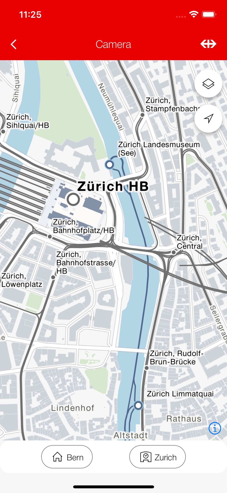
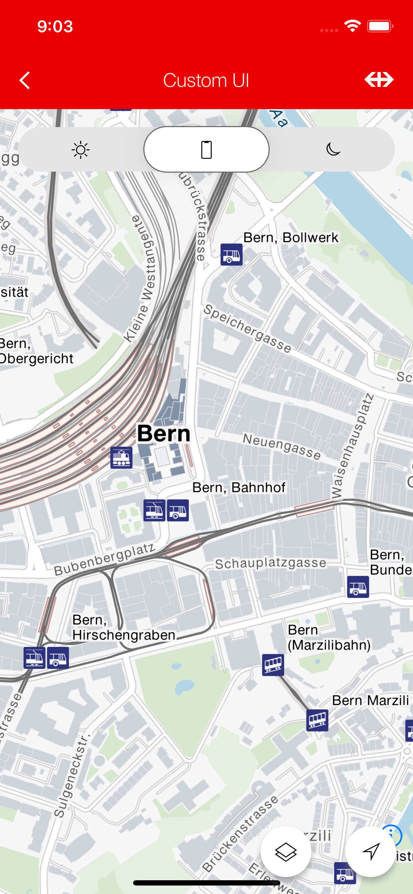
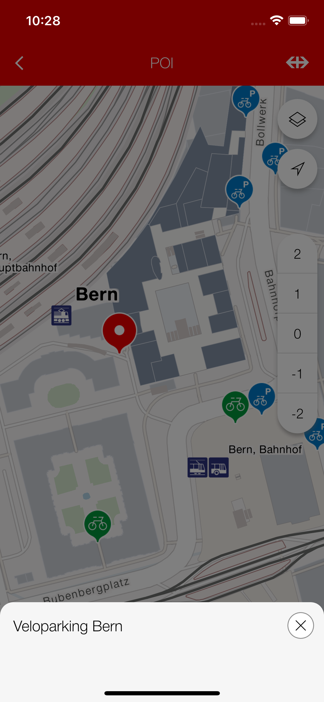

# SBB Maps Flutter

This dart package allows you to easily incorporate SBB maps into your Flutter application.

{width=66%}

## Maintainers

- [Nicolas Vidoni](mailto:nicolas.vidoni@sbb.ch)

## Supported platforms

<div id="supported_platforms">
  
  
</div>

See below for tested versions of these platforms.

## Precondition

As this is a SBB internal package, your build agent needs access to this repository.

## Setup


### 1. Adding the package to your application
Since this package is not on pubdev, you need to add it to your pubspec.yaml file like this:
```
dependencies:
    ...
    sbb_maps_flutter:
      git:
        url: https://code.sbb.ch/scm/ki_rokas/journey-maps-client-flutter.git
        ref: main \\ UNSTABLE, use a tag ref
```

This will get you latest changes from the `main` branch. Replace this with a more recent
`tag` to get a more stable version.

### 2. Accessing ROKAS styles & datasources
In order to access the map tile data and the ROKAS SBB styling, you need to order an API key.
To do so, register your application on the [Journey-Maps API on developer.sbb.ch](https://developer.sbb.ch/apis/journey-maps/information).

For testing purposes **only**, you may use the key included in the Angular Client example on
[angular.app.sbb.ch](https://angular.app.sbb.ch/journey-maps/components/angular/examples). 
Please be aware that this **key may be revoked at any time**. **Do not use it in production builds**.

### 3. In Code Usage

#### Make the API key accessible to your app. 
Either 

1. add it as env var (not recommended):
```sh
JOURNEY_MAPS_API_KEY='YOUR_API_KEY_HERE'
```
2. Or use a package such as [envied](https://pub.dev/packages/envied) for clean env var handling and
   *obfuscating* your API key, making it harder to reverse engineer (in public apps!). Then you simply use a
   `SBBRokasMapStyler` with the api key as constructor parameter. Pass this styler to the `SBBMap` as `mapStyler` parameter.
```dart
SBBRokasMapStyler.full(apiKey: Env.MY_API_KEY_NAME);
```


#### Add the SBBMap widget into your application.

```dart
SBBMap(
  initialCameraPosition: const SBBCameraPosition(
    target: LatLng(46.947456, 7.451123), // Bern
    zoom: 15.0,
  ),
  mapStyler: _customStylerWithApiKey // as from above
)
```

See the gallery below or the example app for more usage examples.

### 5. Accessing User Location

This package uses the [geolocator](https://pub.dev/packages/geolocator) flutter plugin for accessing the device location and
asking the user for permissions. See the package for detailed instructions on accessing the device location. In short:

#### iOS

Add this to your `ios/Runner/Info.plist` file:
```
<key>NSLocationWhenInUseUsageDescription</key>
	<string>YOUR DESCRIPTION WHY YOU NEED ACCESS TO THE MAP</string>
```
This will allow the app to access the location when in usage.

#### Android

Add these to your `android/app/src/main/AndroidManifest.xml`:
```
<uses-permission android:name="android.permission.ACCESS_FINE_LOCATION" />
<uses-permission android:name="android.permission.ACCESS_COARSE_LOCATION" />
```
This will allow the app to access the location when in usage. If both are specified, the
geolocator plugin uses the `ACCESS_FINE_LOCATION` setting.

## Features

| Feature                                 | iOS                | Android            |
| --------------------------------------- | ------------------ | ------------------ |
| Gesture                                 | :white_check_mark: | :white_check_mark: |
| Camera                                  | :white_check_mark: | :white_check_mark: |
| Map Styles (including ROKAS Styles)     | :white_check_mark: | :white_check_mark: |
| Location (including device tracking)    | :white_check_mark: | :white_check_mark: |
| Customizable UI                         | :white_check_mark: | :white_check_mark: |
| Floor Switcher (switch levels)          | :white_check_mark: | :white_check_mark: |
| ROKAS POIs: Display                     | :white_check_mark: | :white_check_mark: |
| ROKAS POIs: Event Triggering and Select | :white_check_mark: | :white_check_mark: |
| **Annotations**                         | :white_check_mark: | :white_check_mark: |
| - Circles (Display & OnClick)           | :white_check_mark: | :white_check_mark: |
| - ROKAS Markers (Display & OnClick)     | :white_check_mark: | :white_check_mark: |
| - Custom Markers  (Display & OnClick)   | :white_check_mark: | :white_check_mark: |
| - Fill Annotations  (Display & OnClick) | :white_check_mark: | :white_check_mark: |
| - Line Annotations  (Display & OnClick) | :white_check_mark: | :white_check_mark: |

### Custom Map Properties

Custom properties of the map (e.g. compass position, disabling certain gestures) can be set using
the `SBBMapProperties` class, given as `properties` parameter in the `SBBMap` constructor.

```dart
// the defaults
const SBBMapProperties({
    this.compassEnabled = true,
    this.compassViewPosition = CompassViewPosition.topLeft,
    this.compassViewMargins,
    this.rotateGesturesEnabled = true,
    this.scrollGesturesEnabled = true,
    this.doubleClickZoomEnabled = true,
    this.dragEnabled = true,
  });
```

## Tested deployment platforms

|                                         | iOS                | Android SDK        |
| --------------------------------------- | ------------------ | ------------------ |
| Oldest Tested                           | 15.5               | 31                 |
| Latest Tested                           | 17.5               | 34                 |

Tested with the latest and oldest Flutter SDK.

## Contributing

Contributions are very welcome. Please contact the maintainers for open questions or open pull requests for contributions.

### Testing

We use mockito and dart test for testing purposes. To generate the mocks, run
```sh
fvm flutter pub run build_runner build --delete-conflicting-outputs
fvm flutter test
```

You may use the flutter sdk version specified in the `Jenkinsfile` pipeline as `FLUTTER_LATEST_SDK` version.

Alternatively, run the `build_and_test.sh` script in the `./scripts/` directory.

## Caveats, limitations and known bugs*

### Limitations

* When selecting POIs programmatically with the `RokasPOIController`, one can only select from the POIs that are loaded in the tile source, meaning that trying to select a POI at a very distant place will not be possible. The workaround would be to first move to the geo coordinate and then select the POI.

## Example

{width=5%}

The **SBB Karten** demo application is available both in the SBB Enterprise Playstore (Android) and in the managed iOS SBB Store (Ivanti MobileIron).

## Gallery

<table style='width:100%'>
  <tr>
    <th>Standard Map</th>
    <th></th>
  </tr>
  <tr>
    <td>The default SBB map with ROKAS styling.</td>
    <td></td>
  </tr>
  <tr>
    <td>
    <div>
      <pre>
        <code>
@override
Widget build(BuildContext context) {
  // api key must be in JOURNEY_MAPS_API_KEY ENV_VAR
  return Scaffold(
    appBar: const SBBHeader(title: 'Standard'),
    body: SBBMap(
      initialCameraPosition: const SBBCameraPosition(
        target: LatLng(46.947456, 7.451123), // Bern
        zoom: 15.0,
      ),
      isMyLocationEnabled: true,
    ),
  );
}
        </code>
      </pre>
      </div>
    </td>
    <td style='text-align: center;'></td>
  </tr>
  <tr>
    <th>Plain Map</th>
    <th></th>
  </tr>
  <tr>
    <td>How to disable all UI components while using ROKAS Map styling.</td>
    <td></td>
  </tr>
  <tr>
    <td>
    <div>
      <pre>
        <code>
@override
Widget build(BuildContext context) {
  final mapStyler = SBBRokasMapStyler.noAerial(apiKey: YOUR_API_KEY);
  return Scaffold(
    appBar: const SBBHeader(title: 'Plain'),
    body: SBBMap(
      initialCameraPosition: const SBBCameraPosition(
        target: LatLng(46.947456, 7.451123), // Bern
        zoom: 8.0,
      ),
      mapStyler: mapStyler,
      isMyLocationEnabled: false,
      isFloorSwitchingEnabled: false,
    ),
  );
}
        </code>
      </pre>
      </div>
    </td>
    <td style='text-align: center;'></td>
  </tr>
    <tr>
    <th>Camera Movement</th>
    <th></th>
  </tr>
  <tr>
    <td>How to programmatically control camera movement.</td>
    <td></td>
  </tr>
  <tr>
    <td>
    <div>
      <pre>
        <code>
@override
Widget build(BuildContext context) {
  // api key must be in JOURNEY_MAPS_API_KEY ENV_VAR
  return Scaffold(
    appBar: const SBBHeader(title: 'Camera'),
    body: SafeArea(
      child: Column(
        children: [
          Expanded(
            child: SBBMap(
              initialCameraPosition: const SBBCameraPosition(
                target: LatLng(46.947456, 7.451123), // Bern
                zoom: 8.0,
              ),
              isMyLocationEnabled: true,
              onMapCreated: (controller) =>
                  mapController.complete(controller),
            ),
          ),
          SBBGroup(
            padding: const EdgeInsets.symmetric(
                horizontal: sbbDefaultSpacing / 2,
                vertical: sbbDefaultSpacing / 2),
            child: Row(
              mainAxisAlignment: MainAxisAlignment.spaceEvenly,
              children: [
                SBBTertiaryButtonSmall(
                  label: 'Bern',
                  icon: SBBIcons.house_small,
                  onPressed: () => mapController.future.then(
                      (c) => c.animateCameraMove(cameraUpdate: _kCameraBern)),
                ),
                SBBTertiaryButtonSmall(
                  label: 'Zurich',
                  icon: SBBIcons.station_small,
                  onPressed: () => mapController.future.then((c) =>
                      c.animateCameraMove(cameraUpdate: _kCameraZurich)),
                )
              ],
            ),
          )
        ],
      ),
    ),
  );
}
        </code>
      </pre>
      </div>
    </td>
    <td style='text-align: center;'></td>
  </tr>
    </tr>
    <tr>
    <th>Custom UI</th>
    <th></th>
  </tr>
  <tr>
    <td>How to customize the map ui using the builder.</td>
    <td></td>
  </tr>
  <tr>
    <td>
    <div>
      <pre>
        <code>
@override
Widget build(BuildContext context) {
  return Scaffold(
    appBar: const SBBHeader(title: 'Custom UI'),
    body: SBBMap(
      initialCameraPosition: const SBBCameraPosition(
        target: LatLng(46.947456, 7.451123), // Bern
        zoom: 15.0,
      ),
      mapStyler: mapStyler,
      isMyLocationEnabled: true,
      isFloorSwitchingEnabled: true,
      builder: (context) => const Align(
        alignment: Alignment.topRight,
        child: Column(
          crossAxisAlignment: CrossAxisAlignment.end,
          mainAxisSize: MainAxisSize.max,
          mainAxisAlignment: MainAxisAlignment.spaceBetween,
          children: [
            ThemeSegmentedButton(),
            Row(
              mainAxisAlignment: MainAxisAlignment.end,
              children: [
                Padding(
                  padding: EdgeInsets.all(sbbDefaultSpacing),
                  child: SBBMapStyleSwitcher(),
                ),
                Padding(
                  padding: EdgeInsets.all(sbbDefaultSpacing),
                  child: SBBMapMyLocationButton(),
                ),
              ],
            )
          ],
        ),
      ),
    ),
  );
}
        </code>
      </pre>
      </div>
    </td>
    <td style='text-align: center;'></td>
  </tr>
    <tr>
    <th>POI</th>
    <th></th>
  </tr>
  <tr>
    <td>How to react to POI selection.</td>
    <td></td>
  </tr>
  <tr>
    <td>
    <div>
      <pre>
        <code>
@override
Widget build(BuildContext context) {
  final mapStyler = SBBRokasMapStyler.full(
    apiKey: Env.journeyMapsApiKey,
    isDarkMode: Provider.of<ThemeProvider>(context).isDark,
  );
  return Scaffold(
    appBar: const SBBHeader(title: 'POI'),
    body: SBBMap(
      initialCameraPosition: const SBBCameraPosition(
        target: LatLng(46.947456, 7.451123), // Bern
        zoom: 15.0,
      ),
      isMyLocationEnabled: true,
      mapStyler: mapStyler,
      poiSettings: SBBMapPOISettings(
        isPointOfInterestVisible: true,
        onPoiControllerAvailable: (poiController) =>
            _poiController.complete(poiController),
        onPoiSelected: (poi) => showSBBModalSheet(
          context: context,
          title: poi.name,
          child: const SizedBox(height: 64),
        ).then(
          (_) => _poiController.future.then(
            (c) => c.deselectPointOfInterest(),
          ),
        ),
      ),
    ),
  );
}
        </code>
      </pre>
      </div>
    </td>
    <td style='text-align: center;'></td>
  </tr>
</table>
